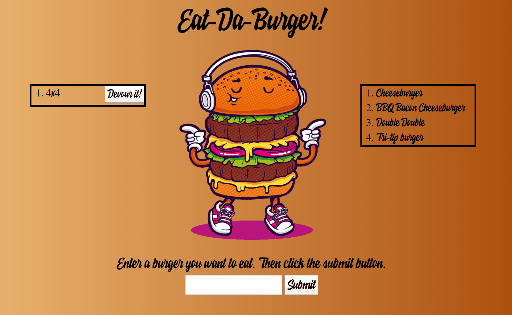
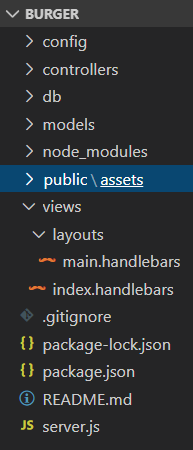
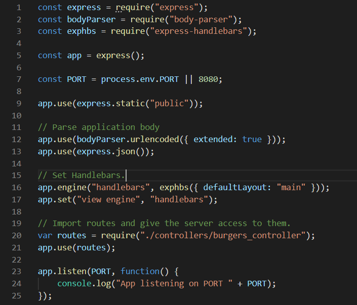
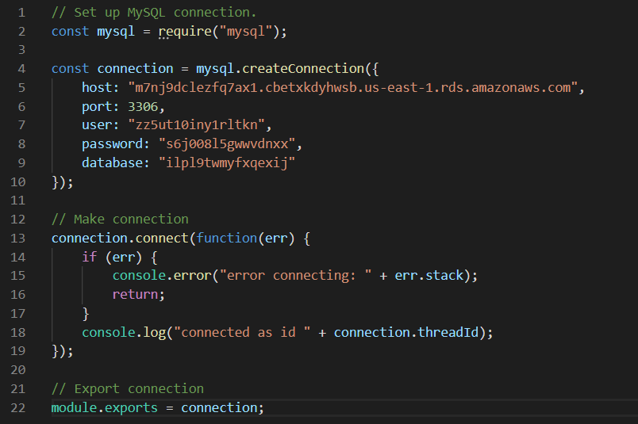
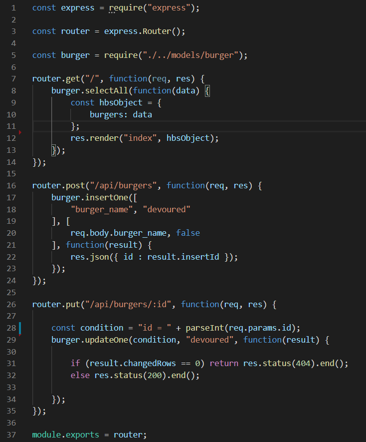
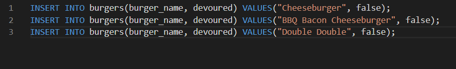
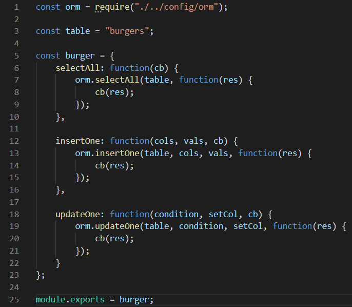
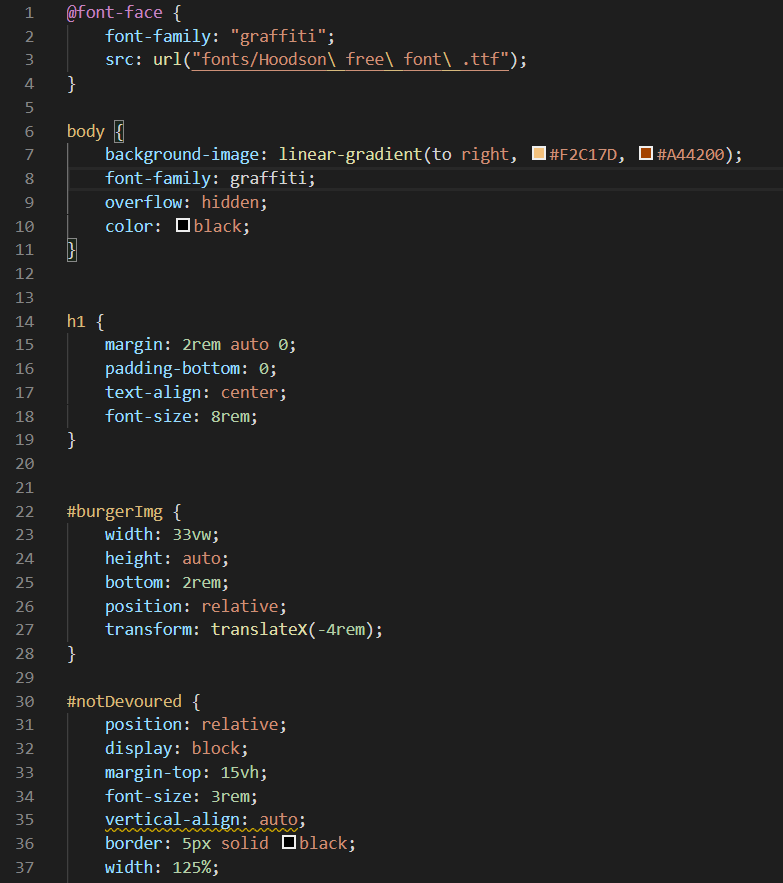
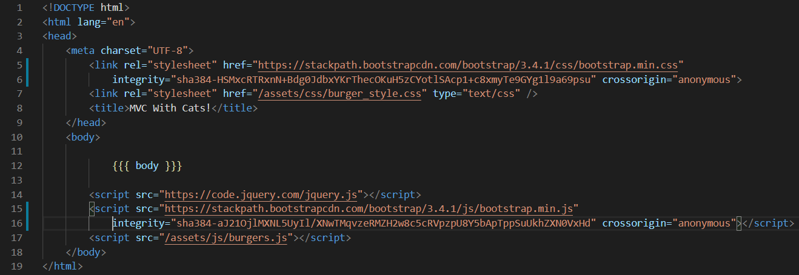
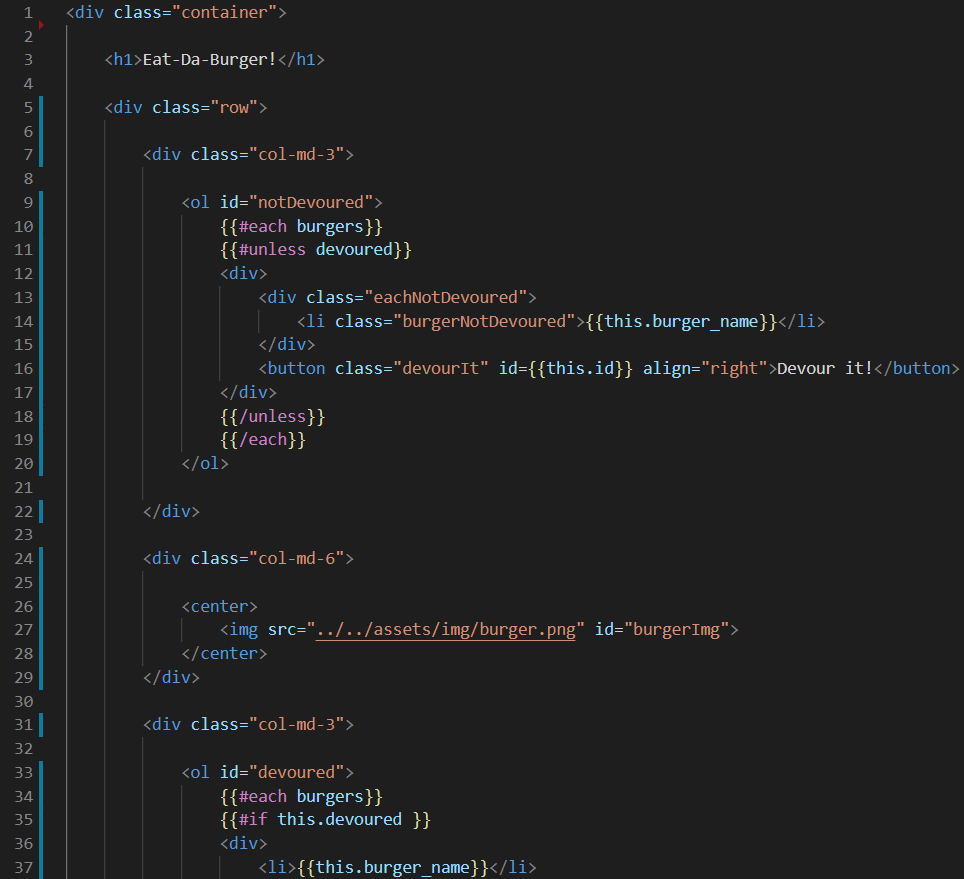

# burger

## The Assignment
To create a burger logger using npm packages. This application will allow the user to add a burger and devour it. This will be dynamically
generated.

## How It Works
This app uses four npm packages: mysql, express, express-handlebars, and body-parser. The user will be given a text box to input the name of a burger and when the submit button is clicked, the name will be stored in the MySQL database. Everytime the page renders or when the submit button is clicked, the app makes a query to MySQL to retrieve all the names stored. This will dynamically generate the burgers in both the left and right tables, depending on whether the burger has been devoured, indicated by a boolean value corresponding to each burger.
Note: This app uses MVC

## Demo

## MVC Filing System

## Screenshots of Code

### server.js

### Config

#### connection.js

#### orm.js

### controllers

#### burgers_controller.js

### db

#### schema.sql

#### seeds.sql

### models

#### burger.js

### public/assets

#### burger_style.css

####  burgers.js

### views

#### main.handlebars

#### index.handlebars

